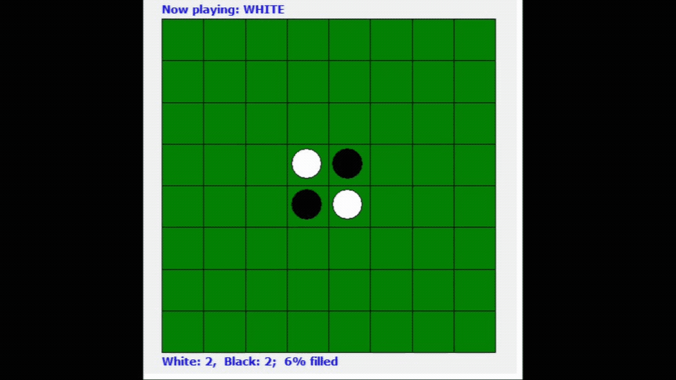
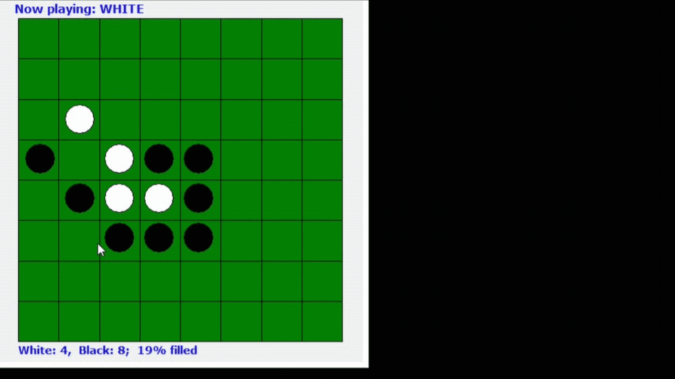
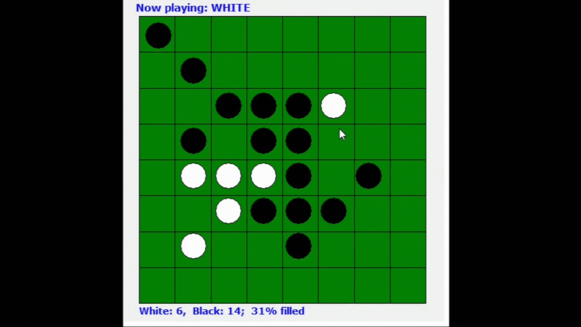
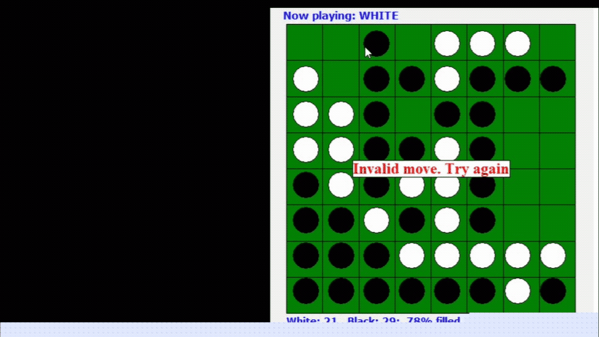

# Othello

Othello or Reversi is a classic strategy board game for two players, played on an 8x8 uncheckered board.
This version is for a single person playing against the computer.

The first four pieces go in the center of the board in a standard diagonal pattern.
Players take turns placing discs on the board with their assigned color.

Each disc played must be laid adjacent to an opponent's disc, so that the opponent's.
During a play, any discs of the opponent's color that are in a straight line and bounded by the disc just placed and another disc of the current player's color are turned over to the current player's color.

The object of the game is to have the majority of discs displaying your color when the last playable empty square is filled.

